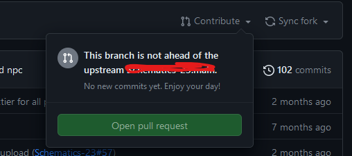
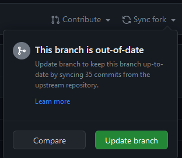

# Berkolaborasi dengan GitHub 
Bab ini dirancang untuk memperkenalkan peserta pada cara-cara praktis berkolaborasi menggunakan GitHub. Dengan pendekatan hands-on, peserta akan langsung mempraktikkan langkah-langkah yang dijelaskan sambil didampingi pemateri. Setiap tugas akan memperkuat pemahaman peserta terhadap konsep yang diajarkan.

## Fork

Fork adalah cara untuk berkontribusi pada sebuah repository yang dimiliki oleh orang lain. Dengan melakukan fork, kita akan memiliki repository yang sama persis dengan repository orang lain. Perubahan yang dilakukan pada repository hasil fork tidak akan mempengaruhi repository aslinya.

Untuk melakukan fork, kita dapat menggunakan tombol fork yang ada pada repository orang lain.


Setelah melakukan fork, kita akan memiliki repository yang sama persis dengan repository orang lain. Repository tersebut akan berada pada akun kita.

### Issue

Issue digunakan untuk melacak tugas, perbaikan, atau diskusi pada repository. Issue dapat digunakan untuk berkolaborasi dengan orang lain pada repository.

Didalam issue, kita dapat memberikan label, assignee, dan milestone. Label digunakan untuk memberikan kategori pada issue. Assignee digunakan untuk menunjuk orang yang bertanggung jawab pada issue. Milestone digunakan untuk memberikan target waktu pada issue.

### Contribute

Untuk melakukan contribusi antara repository yang ada pada akun kita dengan repository aslinya, kita dapat melakukan pull request. Untuk melakukan pull request, kita dapat menggunakan tombol contribute yang ada pada repository hasil fork. Setelah itu, kita dapat memilih open pull request.



- Case diatas kita belum melakukan perubahan apapun pada repository hasil fork.

### Sync Fork

Sedangkan untuk melakukan sinkronisasi antara repository hasil fork dengan repository aslinya, kita dapat menggunakan tombol sync yang ada pada repository hasil fork. Setelah itu, kita dapat memilih fetch upstream.



Dan kita dapat menekan tombol update branch untuk melakukan sinkronisasi.

### Langkah-langkah Forking
Akses Repository: Buka repository di GitHub yang ingin Anda fork. Contoh, pemateri menyediakan link ke repository demo-repository.
Klik Tombol Fork: Tombol ini terletak di bagian kanan atas halaman repository.
Konfirmasi Forking: Setelah klik, GitHub akan membuat salinan repository tersebut di akun Anda. Repository hasil fork dapat ditemukan di daftar repository.

### Task 1: Fork Repository
Instruksi: Fork repository yang telah disediakan oleh pemateri. Pastikan repository tersebut muncul di akun Anda.
Tujuan: Memastikan peserta memahami cara fork dan menemukan repository di akun mereka.

Membuat Perubahan di Fork Anda
Setelah fork selesai, Anda dapat memodifikasi file di repository Anda. Perubahan ini tidak akan memengaruhi repository asli. Misalnya, tambahkan nama Anda ke file README.md.

### Task 2: Edit dan Pull Request

Edit File: Buka file README.md di repository hasil fork dan copy file readme dan rename dengan nama Anda.

1. Buat File: Buat file `<nama anda>`.md di repository hasil fork dan tambahkan nama Anda ke dalam daftar kontributor.

- Contoh isi file sebelum perubahan:

```markdown
# Daftar Kontributor  
- Alice  
- Bob  
```
- Setelah diedit:

```markdown
# Daftar Kontributor  
- Alice  
- Bob  
- [Nama Anda]  
```

2. Commit dan Push: Simpan perubahan dan commit melalui GitHub.

3. Buat Pull Request:
Klik tombol Pull Request pada repository fork.
Berikan judul deskriptif, misalnya, "Add my name to contributors".
Kirim permintaan ke repository asli.

> Pull request adalah cara untuk berkontribusi pada repository orang lain. Pull request memungkinkan pemilik repository asli untuk meninjau perubahan yang Anda buat dan menggabungkannya ke repository asli.

## Sinkronisasi Repository Fork dengan Repository Asli

Ketika repository asli diperbarui, fork Anda bisa menjadi usang. Fitur Sync Fork digunakan untuk memperbarui repository fork agar selaras dengan repository asli.

### Langkah-Langkah Sync Fork

1. Buka repository hasil fork.
2. Klik tombol Fetch upstream di GitHub.
3. Pilih Sync fork dan klik Update branch untuk menggabungkan perubahan dari repository asli.

### Task 3: Sinkronkan Repository Fork
1. Pemateri akan memperbarui repository asli dengan file baru.
2. Peserta diminta melakukan sinkronisasi pada fork mereka untuk mendapatkan file baru tersebut.

## Cloning Repository untuk Kolaborasi Lokal

Cloning digunakan untuk bekerja secara lokal pada repository, terutama jika Anda memiliki akses kontribusi langsung.

### Langkah Cloning

1. Klik tombol Code di halaman repository GitHub.
2. Salin URL repository.
3. Di terminal, jalankan perintah:

```
git clone <URL-repository>
```
4. Buka folder repository yang di-clone dan mulai bekerja.

### Task 4: Clone dan Modifikasi File

1. Clone repository demo-pelatihan-vsc-rpl-2024 setelah di fork ke komputer Anda.
2. Tambahkan file baru, misalnya, new-feature.txt, lalu isi dengan teks:

```
Fitur baru dari [Nama Anda]
```

3. Commit perubahan dan push ke repository asli.

```bash
git add new-feature.txt  
git commit -m "Add new feature"  
git push  
```

## Conflict

Conflict terjadi ketika terdapat perubahan yang dilakukan pada baris yang sama pada file yang sama. Conflict dapat terjadi ketika kita melakukan merge atau pull request.

Langsung saja kita simulasikan conflict.


## Rebase Vs Merge Vs Squash

Rebase, merge, dan squash adalah tiga cara untuk menggabungkan perubahan dari branch lain ke branch utama.

### Rebase

Rebase digunakan untuk menggabungkan perubahan dari branch lain ke branch utama. Perbedaan utama dengan merge adalah rebase mengubah sejarah commit.

### Merge

Merge digunakan untuk menggabungkan perubahan dari branch lain ke branch utama. Merge tidak mengubah sejarah commit.

### Squash

Squash digunakan untuk menggabungkan beberapa commit menjadi satu commit. Squash berguna untuk mengurangi jumlah commit dan memperbaiki sejarah commit.


